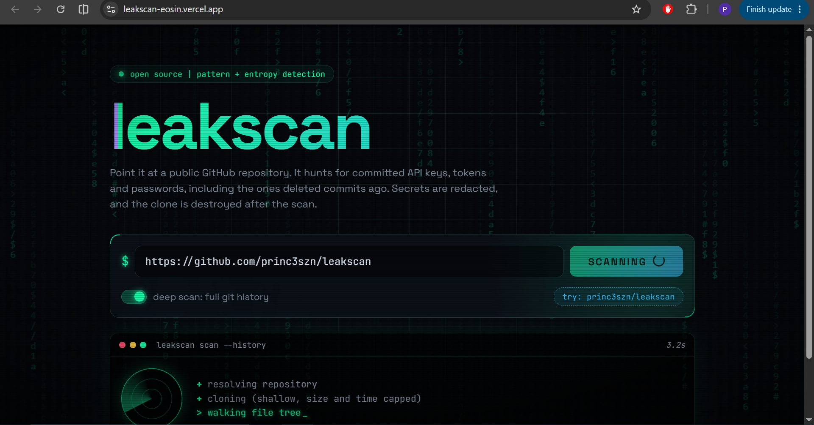
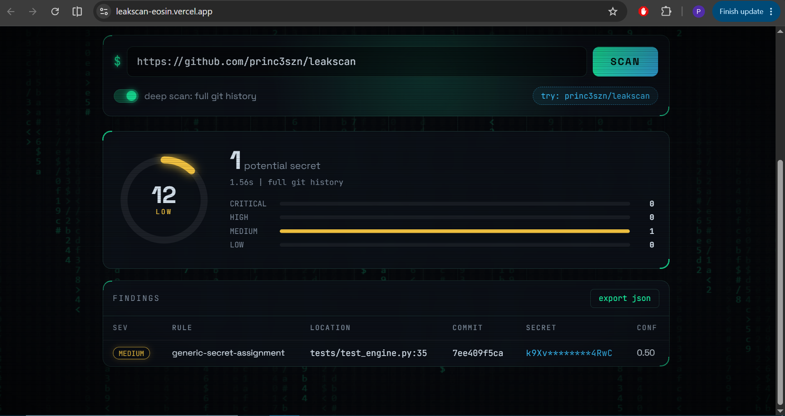
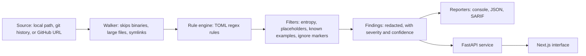

# leakscan

[](https://github.com/princ3szn/leakscan/actions/workflows/ci.yml)
[](LICENSE.md)


A secrets and credential leak scanner, built from scratch. It scans a local folder, a repository's full git history, or a public GitHub repository for accidentally committed API keys, tokens, and passwords, using pattern matching, Shannon entropy, and keyword context.

**Live demo: https://leakscan-eosin.vercel.app/**




The demo API runs on a free tier and sleeps when idle, so the first scan after a quiet period can take up to a minute.

## Why history matters

Deleting a leaked key from a file does not remove it from git. Anyone who can clone the repository can read the old commit. leakscan scans every commit on every branch, so it finds secrets that were committed and removed later.

This repository's own history shows it working. The current tree is clean, but an early commit contains a fake test password, and `--history` finds it:

```text
$ leakscan scan . --history
[MEDIUM  ] generic-secret-assignment  tests/test_engine.py:35 @ 7ee409f5ca  k9Xv********4RwC  (confidence 0.50)

1 potential secret(s) found.
```

## Features

- Eleven detection rules defined in a TOML file, easy to extend
- Entropy, placeholder, and known-example filtering to cut false positives on generic rules
- Full git history scanning with commit, author, and line number
- Scans local paths or public GitHub URLs (shallow clone with size and time limits)
- Secrets are redacted before output: console, JSON, and SARIF 2.1.0 reporters
- Inline suppression with `# leakscan:ignore`
- Exit code 1 when secrets are found, so it can gate a CI pipeline
- FastAPI service and a Next.js web interface
- A labeled benchmark that reports precision and recall

## Quick start

```bash
git clone https://github.com/princ3szn/leakscan.git
cd leakscan
python -m venv .venv
source .venv/bin/activate        # Windows: .venv\Scripts\activate
pip install -e ".[dev,api]"
```

```bash
leakscan scan .                                  # scan the working tree
leakscan scan . --history                        # scan every commit on every branch
leakscan scan https://github.com/owner/repo      # shallow clone and scan a public repo
leakscan scan . --format json                    # machine readable output
leakscan scan . --format sarif > leakscan.sarif  # GitHub code scanning format
```

Exit codes: `0` clean, `1` secrets found, `2` error.

## Detection rules

| Rule ID | Detects | Severity |
|---|---|---|
| `aws-access-key-id` | AWS access key IDs | high |
| `github-pat` | GitHub personal access tokens | critical |
| `github-fine-grained-pat` | GitHub fine-grained tokens | critical |
| `stripe-live-key` | Stripe live secret and restricted keys | critical |
| `google-api-key` | Google API keys | high |
| `slack-token` | Slack tokens | high |
| `private-key` | Private key headers (RSA, EC, DSA, OpenSSH, PGP) | critical |
| `jwt` | JSON Web Tokens | medium |
| `url-embedded-credentials` | Passwords inside connection URLs | high |
| `generic-secret-assignment` | Quoted values assigned to names like password, secret, token, api_key | medium |
| `generic-unquoted-assignment` | UPPER_CASE env-style assignments such as DB_PASSWORD=value | medium |

Rules live in `src/leakscan/rules/default_rules.toml`.

## How it works



1. **Walker.** Skips `.git`, `node_modules`, virtual environments, lockfiles, images and other binaries, symlinks, and files over 1 MB.
2. **Rule engine.** Each line is checked against the TOML-defined regex rules. Specific rules run before generic ones so one secret is reported once.
3. **Filters.** Generic rules only report values with Shannon entropy of at least 3.0 bits. Placeholders (`your_api_key_here`, `${VAR}`, `<password>`, `changeme`), numeric-only values, and vendor-documented example keys are dropped.
4. **History.** `git log --all -p -U0` is streamed and only added lines are scanned. Each finding carries the commit hash, author, and line number in the new file.
5. **Redaction.** Secrets are masked inside the scanner, so console output, JSON, SARIF, and the API never contain a full secret.

## Benchmark

`python benchmark/run.py` scores the scanner on a labeled corpus of 31 files: 17 with a real (generated) secret, including 3 deliberately hard cases, and 14 tricky non-secrets such as placeholders, UUIDs, hashes, translation strings, and base64 image data. The corpus is generated at runtime from a fixed seed, so the repository never contains complete secret-shaped strings.

| Version | TP | FP | FN | Precision | Recall | F1 |
|---|---|---|---|---|---|---|
| Initial rules | 14 | 3 | 3 | 0.82 | 0.82 | 0.82 |
| After URL, unquoted, and example-key fixes | 16 | 1 | 1 | 0.94 | 0.94 | 0.94 |

Changes between the two runs: a rule for passwords inside connection URLs, a rule for unquoted `KEY=value` assignments, skipping keys published in vendor documentation, and ignoring numeric-only values.

Two errors remain on purpose:

- **Miss:** a real but low-entropy password. Catching it means lowering the entropy threshold, which would also flag ordinary strings such as translations. I did not tune to the corpus.
- **False positive:** a test-fixture password. By pattern alone it looks like a real one. The fix is path allowlists (see the roadmap).

This corpus is small and synthetic. It demonstrates the method and the tuning loop, not general accuracy. The script also scores gitleaks on the same corpus if it is installed; I have not published that comparison yet.

## Security of the public demo

A service that clones user-supplied URLs needs defenses, so:

- Only exact `https://github.com/owner/repo` URLs are accepted, and the clone URL is rebuilt from validated parts. Option injection and non-HTTPS protocols are rejected.
- Symlinks are disabled at checkout and skipped during the scan, so a hostile repository cannot make the server read its own files.
- Clones are killed after 60 seconds or 100 MB, and the temporary directory is always deleted.
- Scanned code is never executed.
- Per-IP rate limit (5 scans per minute), at most 2 concurrent scans, and at most 500 findings returned.
- Secrets are redacted before leaving the scanner. CORS is limited to the frontend origin. The container runs as a non-root user.
- Only public repositories are supported.

This is a portfolio demo on free hosting. It is not hardened against sustained, determined abuse.

## Suppressing findings

Add `# leakscan:ignore` (any comment style) to a line to skip it.

## Using it in CI

```yaml
- run: pip install git+https://github.com/princ3szn/leakscan.git
- run: leakscan scan . --format sarif > leakscan.sarif || true
- uses: github/codeql-action/upload-sarif@v3
  with:
    sarif_file: leakscan.sarif
```

## Project layout

```text
leakscan/
  src/leakscan/
    engine.py        rule engine and filters
    entropy.py       Shannon entropy helpers
    models.py        Finding model and redaction
    walker.py        file discovery and filtering
    gitscan.py       git history scanning
    remote.py        safe shallow clone of GitHub URLs
    reporters.py     SARIF output
    api.py           FastAPI service
    cli.py           command line interface
    rules/default_rules.toml
  tests/             pytest suite
  benchmark/         labeled corpus and scoring script
  web/               Next.js interface
  Dockerfile         API container
  .github/workflows/ci.yml
```

## Development

```bash
pytest
python benchmark/run.py
uvicorn leakscan.api:app --reload      # API on :8000
cd web && npm install && npm run dev   # UI on :3000
```

Environment variables: `LEAKSCAN_ALLOWED_ORIGINS` (API, comma-separated origins) and `NEXT_PUBLIC_API_URL` (web, API base URL). The API is deployed from the Dockerfile on Render with `--proxy-headers` so the rate limit sees real client addresses, and the web app is deployed on Vercel.

## Known limitations and roadmap

Limitations:

- Entropy currently acts as a filter on the generic rules. It is not yet a standalone detector, so secrets in unknown formats with no keyword nearby are missed.
- Low-entropy real passwords are missed.
- Test fixtures can be flagged, because there is no path allowlist yet.
- It detects patterns only. It does not check whether a key is still valid.
- Secrets that are encoded, split across lines, or obfuscated are not detected.

Roadmap:

- `.leakscan.toml` config with path allowlists and a baseline file
- Standalone entropy detector for unknown token formats
- Opt-in live verification of key validity
- More vendor rules
- Published gitleaks comparison
- PyPI release

## Lessons from building it

GitGuardian flagged this repository's test fixtures twice, which taught me that a secrets scanner has to survive its own test data. Fixtures are now assembled from fragments at runtime, and CI runs leakscan against the repository on every push.

## License

MIT, see [LICENSE.md](LICENSE.md).

Built by [Prince Fumen Aminu](https://github.com/princ3szn).